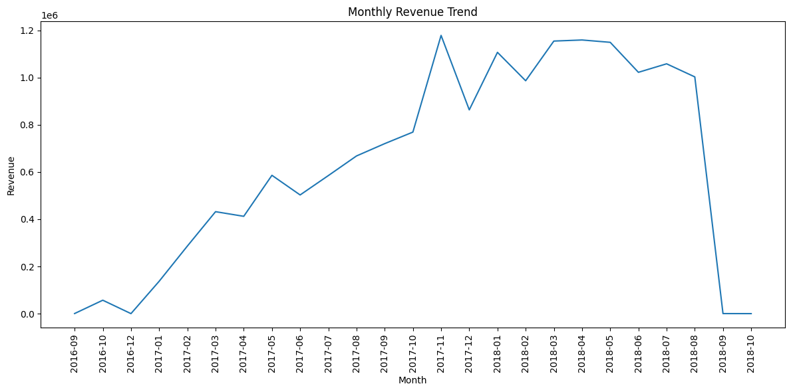
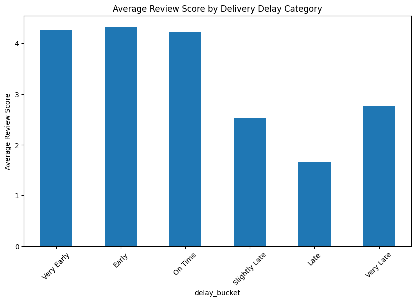

# Brasimart E-Commerce Analytics

## Overview
This project demonstrates an end-to-end e-commerce analytics workflow using the public OLIST Brazilian e-commerce dataset.  
Transactional data was modeled and loaded into Azure SQL and analyzed using Python to generate insights on revenue performance, customer behavior, retention, and operational efficiency.

The goal of this project was to simulate a production-grade analytics pipeline and translate raw transactional data into actionable business insights.

---

## Architecture
**Data Source → Azure SQL → Python Analytics → Business Insights**

- Data Storage: Azure SQL Database  
- Authentication: Microsoft Entra ID (token-based via Azure CLI)  
- Analytics & Modeling: Python (Pandas, NumPy)  
- Visualization: Matplotlib, Seaborn  
- Version Control: Git & GitHub  

---

## Key Analyses

### Revenue Trend Analysis
- Evaluated monthly revenue growth and seasonality
- Identified sustained revenue expansion patterns

### Customer Lifetime Value (CLV)
- Calculated lifetime spend per customer
- Identified strong revenue concentration among top customers
- Observed Pareto-like revenue distribution

### Cohort Retention Analysis
- Grouped customers by first purchase month
- Measured retention decay over time
- Identified limited repeat purchase behavior

### RFM Segmentation
- Segmented customers based on Recency, Frequency, and Monetary value
- Identified high-value and at-risk customer segments

### Operational Performance
- Analyzed delivery performance relative to estimated delivery dates
- Found most orders delivered earlier than promised
- Quantified customer satisfaction impact of late deliveries

### Product & Category Insights
- Analyzed revenue concentration across product categories
- Compared category-level revenue and customer satisfaction
- Identified potential optimization opportunities in high-volume segments

---

## Business Insights
- Revenue is driven by a small subset of high-value customers.
- Customer retention declines sharply after initial purchase.
- Delivery reliability has a measurable impact on customer satisfaction.
- High-revenue categories do not always align with highest review scores.
- Targeted retention and operational improvements could significantly enhance profitability.

---

## Repository Structure

- `notebooks/` – End-to-end analytics notebook  
- `schema/` – Database schema and table creation scripts  
- `sql/` – Analytical SQL queries  
- `docs/` – Diagrams and visual assets  
- `data/` – Processed data outputs (raw source data excluded)  

---

## Data Source
OLIST Brazilian E-commerce Public Dataset (Kaggle)

---

## Sample Visualizations

### Monthly Revenue Trend

### Delivery Performance and Customer Satisfaction

---

## Skills Demonstrated
- SQL data modeling and relational design  
- Secure Azure SQL connectivity using Microsoft Entra authentication  
- Analytics fact table construction  
- Customer analytics (CLV, RFM, Cohort Analysis)  
- Operational and product performance analysis  
- Business storytelling with data  
